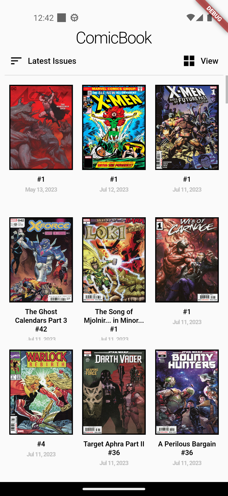
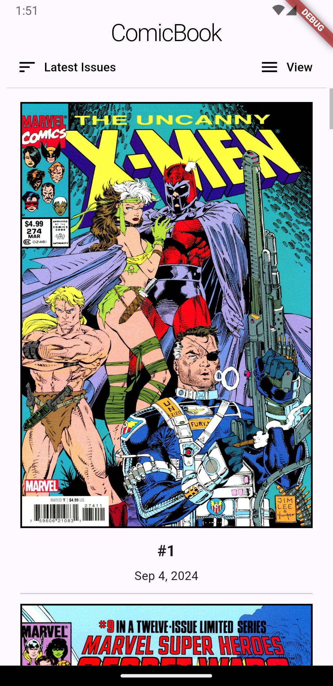
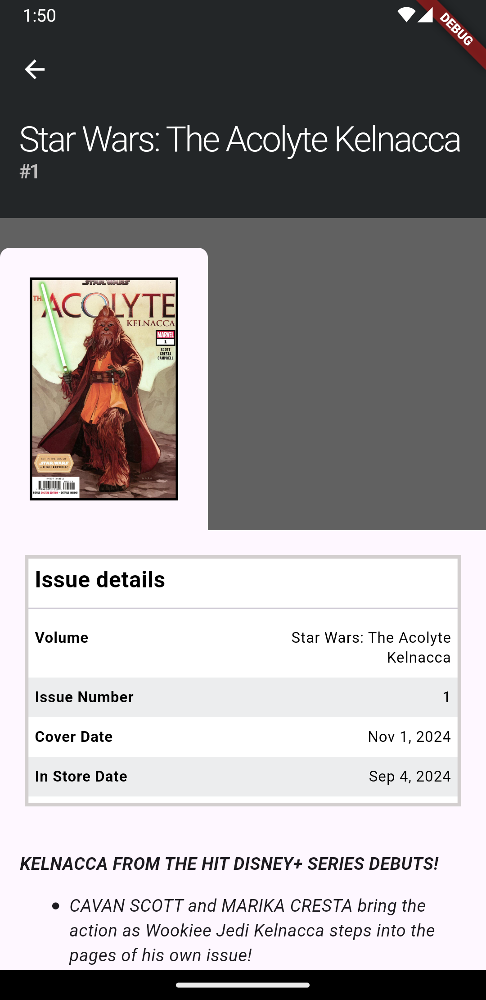

# Comic Book APP

A comic book app using [comic Vine API](https://comicvine.gamespot.com/api/documentation) with Bloc

All features were tested using Flutter **3.24.6** and Dart **3.5.0**

Features:
- Sort by new/old issues
- Swap between grid and list mode
- Infinite scrolling pagination (as long as there are issues to load)
- Detail issues with all the information (characters, teams, creators, arcs, volume, etc)
- All requests are cached, but refreshing them in the UI will force to fecth the data from the server
- Compatible with both Mobile and Tablets
- Cache of images to reduce network calls (issues won't change covers anyway)

You can change your api key in the code or by passing the environment variable in the terminal ```--dart-define=[your_api_key]```

  